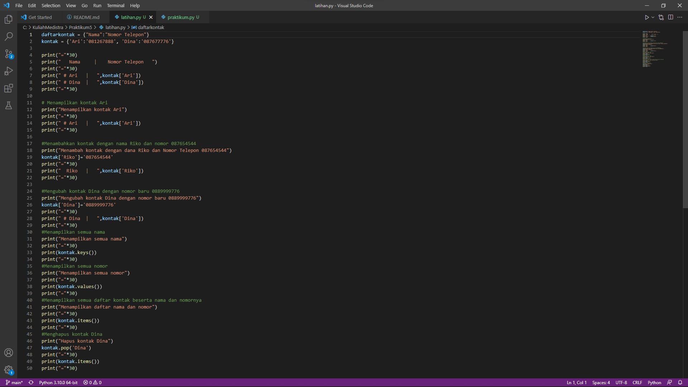
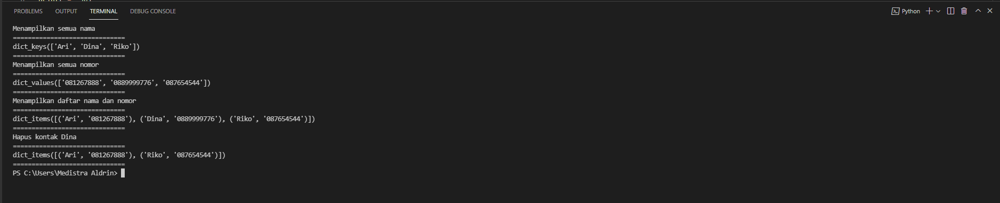
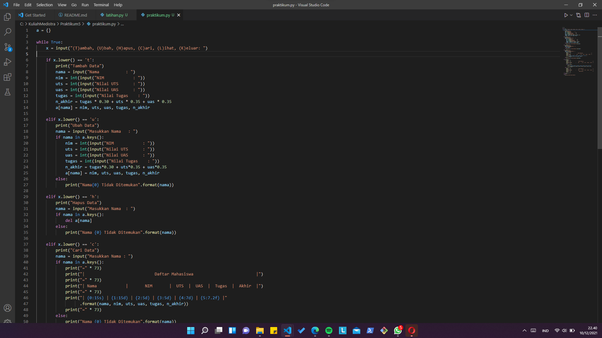
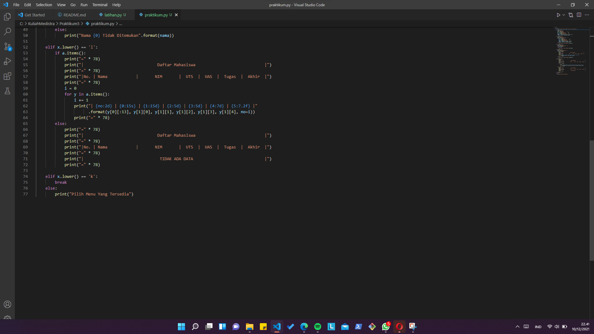
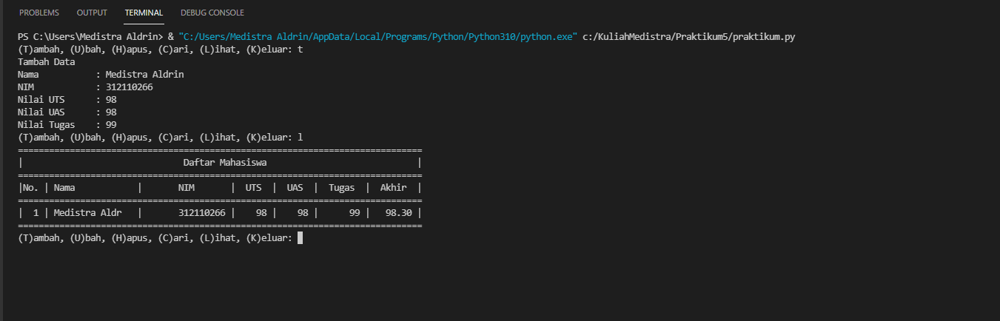
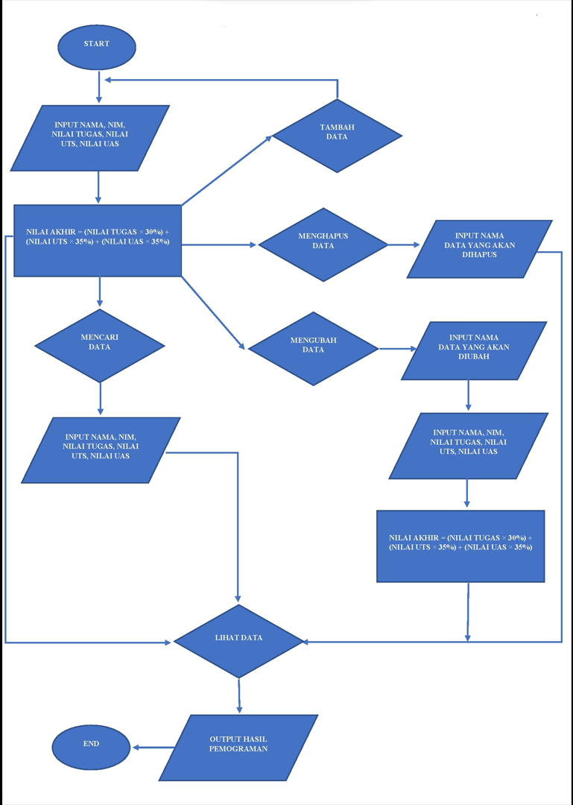

# Praktikum5

## latihan
### codingan

daftarkontak = {"Nama":"Nomor Telepon"}
kontak = {'Ari':'081267888', 'Dina':'087677776'}

print("="*30)
print("   Nama     |    Nomor Telepon   ")
print("="*30)
print(" # Ari   |   ",kontak['Ari'])
print(" # Dina  |   ",kontak['Dina'])
print("="*30)

# Menampilkan kontak Ari
print("Menampilkan kontak Ari")
print("="*30)
print(" # Ari   |   ",kontak['Ari'])
print("="*30)

#Menambahkan kontak dengan nama Riko dan nomor 087654544
print("Menambah kontak dengan dana Riko dan Nomor Telepon 087654544")
kontak['Riko']='087654544'
print("="*30)
print("  Riko   |   ",kontak['Riko'])
print("="*30)

#Mengubah kontak Dina dengan nomor baru 0889999776
print("Mengubah kontak Dina dengan nomor baru 0889999776")
kontak['Dina']='0889999776'
print("="*30)
print(" # Dina  |   ",kontak['Dina'])
print("="*30)
#Menampilkan semua nama
print("Menampilkan semua nama")
print("="*30)
print(kontak.keys())
print("="*30)
#Menampilkan semua nomor
print("Menampilkan semua nomor")
print("="*30)
print(kontak.values())
print("="*30)
#Menampilkan semua daftar kontak beserta nama dan nomornya
print("Menampilkan daftar nama dan nomor")
print("="*30)
print(kontak.items())
print("="*30)
#Menghapus kontak Dina
print("Hapus kontak Dina")
kontak.pop('Dina')
print("="*30)
print(kontak.items())
print("="*30)

### Contoh Gambar

### Hasil codingan

## praktikum
### Codingan

a = {}

while True:
    x = input("(T)ambah, (U)bah, (H)apus, (C)ari, (L)ihat, (K)eluar: ")

    if x.lower() == 't':
        print("Tambah Data")
        nama = input("Nama           : ")
        nim = int(input("NIM            : "))
        uts = int(input("Nilai UTS      : "))
        uas = int(input("Nilai UAS      : "))
        tugas = int(input("Nilai Tugas    : "))
        n_akhir = tugas * 0.30 + uts * 0.35 + uas * 0.35
        a[nama] = nim, uts, uas, tugas, n_akhir

    elif x.lower() == 'u':
        print("Ubah Data")
        nama = input("Masukkan Nama   : ")
        if nama in a.keys():
            nim = int(input("NIM            : "))
            uts = int(input("Nilai UTS      : "))
            uas = int(input("Nilai UAS      : "))
            tugas = int(input("Nilai Tugas    : "))
            n_akhir = tugas*0.30 + uts*0.35 + uas*0.35
            a[nama] = nim, uts, uas, tugas, n_akhir
        else:
            print("Nama{0} Tidak Ditemukan".format(nama))

    elif x.lower() == 'h':
        print("Hapus Data")
        nama = input("Masukkan Nama  : ")
        if nama in a.keys():
            del a[nama]
        else:
            print("Nama {0} Tidak Ditemukan".format(nama))

    elif x.lower() == 'c':
        print("Cari Data")
        nama = input("Masukkan Nama : ")
        if nama in a.keys():
            print("=" * 73)
            print("|                             Daftar Mahasiswa                          |")
            print("=" * 73)
            print("| Nama            |       NIM       |  UTS  |  UAS  |  Tugas  |  Akhir  |")
            print("=" * 73)
            print("| {0:15s} | {1:15d} | {2:5d} | {3:5d} | {4:7d} | {5:7.2f} |"
                  .format(nama, nim, uts, uas, tugas, n_akhir))
            print("=" * 73)
        else:
            print("Nama {0} Tidak Ditemukan".format(nama))

    elif x.lower() == 'l':
        if a.items():
            print("=" * 78)
            print("|                               Daftar Mahasiswa                             |")
            print("=" * 78)
            print("|No. | Nama            |       NIM       |  UTS  |  UAS  |  Tugas  |  Akhir  |")
            print("=" * 78)
            i = 0
            for y in a.items():
                i += 1
                print("| {no:2d} | {0:15s} | {1:15d} | {2:5d} | {3:5d} | {4:7d} | {5:7.2f} |"
                      .format(y[0][:13], y[1][0], y[1][1], y[1][2], y[1][3], y[1][4], no=i))
                print("=" * 78)
        else:
            print("=" * 78)
            print("|                               Daftar Mahasiswa                             |")
            print("=" * 78)
            print("|No. | Nama            |       NIM       |  UTS  |  UAS  |  Tugas  |  Akhir  |")
            print("=" * 78)
            print("|                                TIDAK ADA DATA                              |")
            print("=" * 78)

    elif x.lower() == 'k':
        break
    else:
        print("Pilih Menu Yang Tersedia")

### Contoh gambar

### Hasil codingan

### Flowchart

